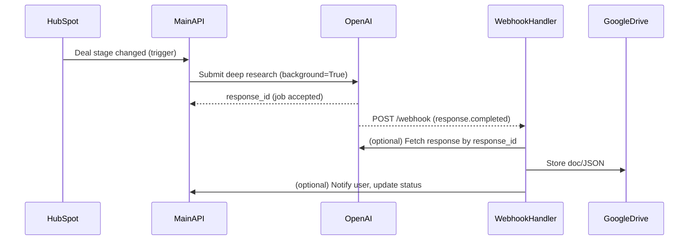

# Webhook-Based GTM Strategy Document Generator

This system uses OpenAI's webhook functionality to handle long-running deep research jobs asynchronously, eliminating the need to keep servers alive during processing.

## Architecture Overview



## Key Benefits

- **No server timeouts**: Submit jobs and shut down compute
- **Scalability**: Handle many concurrent jobs without resource exhaustion
- **Reliability**: OpenAI retries delivery if your endpoint is unavailable
- **Cost efficiency**: Only pay for compute when processing results
- **Automatic retry**: OpenAI handles retries for up to 72 hours

## Setup Instructions

### 1. Environment Variables

Add these to your `.env` file:

```bash
# OpenAI Configuration
OPENAI_API_KEY=your_openai_api_key
OPENAI_WEBHOOK_SECRET=your_webhook_secret  # Get this from OpenAI dashboard

# Google Services (for document generation)
GOOGLE_APPLICATION_CREDENTIALS=path/to/credentials.json
GS_TEMPLATE_DOC_ID=your_template_doc_id
GS_DRIVE_FOLDER_ID=your_drive_folder_id

# Optional: Database for job tracking (recommended for production)
DATABASE_URL=your_database_url
```

### 2. Deploy Webhook Handler

The webhook handler needs to be accessible from the public internet.

#### Option A: Cloud Run (Recommended)

```bash
# Build and deploy to Google Cloud Run
gcloud run deploy gtm-webhook-handler \
  --source . \
  --platform managed \
  --region us-central1 \
  --allow-unauthenticated \
  --set-env-vars OPENAI_API_KEY=$OPENAI_API_KEY,OPENAI_WEBHOOK_SECRET=$OPENAI_WEBHOOK_SECRET
```

#### Option B: Local Development with ngrok

```bash
# Install ngrok
brew install ngrok  # macOS
# or download from https://ngrok.com/

# Start webhook handler
python webhook_handler.py

# In another terminal, expose localhost
ngrok http 8000
```

### 3. Configure OpenAI Webhook

1. Go to [OpenAI Webhook Settings](https://platform.openai.com/settings/project/webhooks)
2. Click "Create" to add a new webhook endpoint
3. Configure:
   - **Name**: GTM Document Generator
   - **URL**: `https://your-domain.com/webhook/openai`
   - **Events**: Select `response.completed`
4. Save the webhook secret and add it to your environment variables

### 4. Test the System

```bash
# Test webhook handler
python dev/test_webhook_system.py --handler

# Test job submission
python dev/test_webhook_system.py --submission

# Test both
python dev/test_webhook_system.py
```

## API Endpoints

### Main API (`main.py`)

- `POST /generate` - Submit a background deep research job
- `GET /job-status/{response_id}` - Check job status
- `GET /health` - Health check

### Webhook Handler (`webhook_handler.py`)

- `POST /webhook/openai` - Receive OpenAI webhook events
- `POST /submit-job` - Alternative job submission endpoint
- `GET /job-status/{response_id}` - Check job status
- `GET /health` - Health check

## Usage Examples

### Submit a Job

```python
import requests

# Submit background job
response = requests.post("https://your-api.com/generate", json={
    "companyId": 12345,
    "stageTs": "2024-01-15T10:30:00Z",
    "company": {
        "name": "Example Corp",
        "industry": "Software",
        # ... other company data
    },
    "enriched_data": {
        # ... enriched data from Clay
    }
})

print(f"Job submitted: {response.json()['response_id']}")
```

### Check Job Status

```python
response_id = "resp_abc123"
status = requests.get(f"https://your-api.com/job-status/{response_id}")
print(status.json())
```

## Production Considerations

### 1. Database Integration

Replace the in-memory `job_tracker` with a proper database:

```python
# Example with PostgreSQL
import psycopg2
from psycopg2.extras import RealDictCursor

def store_job_metadata(response_id: str, metadata: dict):
    with psycopg2.connect(DATABASE_URL) as conn:
        with conn.cursor(cursor_factory=RealDictCursor) as cur:
            cur.execute("""
                INSERT INTO jobs (response_id, metadata, status, created_at)
                VALUES (%s, %s, %s, NOW())
            """, (response_id, json.dumps(metadata), 'submitted'))
```

### 2. Error Handling and Monitoring

- Add comprehensive logging
- Set up alerts for webhook failures
- Monitor job completion rates
- Track token usage and costs

### 3. Security

- Always verify webhook signatures
- Use HTTPS for all endpoints
- Implement rate limiting
- Add authentication for job submission

### 4. Scaling

- Use a message queue (Redis, RabbitMQ) for job processing
- Implement horizontal scaling for webhook handlers
- Add caching for frequently accessed data

## Troubleshooting

### Webhook Not Receiving Events

1. Check webhook URL is accessible
2. Verify webhook secret is correct
3. Check logs for signature verification errors
4. Ensure endpoint returns 2xx status codes

### Jobs Not Completing

1. Check webhook handler logs
2. Verify OpenAI API key has necessary permissions
3. Check Google Drive permissions
4. Monitor token usage and rate limits

### Local Development Issues

1. Use ngrok for webhook testing
2. Check environment variables are loaded
3. Verify all dependencies are installed
4. Test with OpenAI's webhook test tools

## Monitoring and Logging

The system includes comprehensive logging:

```python
# Example log output
2024-01-15 10:30:00 INFO - Submitted background job: resp_abc123
2024-01-15 10:45:00 INFO - Received webhook event: response.completed
2024-01-15 10:45:01 INFO - Processing response resp_abc123
2024-01-15 10:45:05 INFO - Successfully created Google Doc: https://docs.google.com/...
```

## Cost Optimization

- Monitor token usage with the built-in token counting
- Set up alerts for high-cost jobs
- Consider caching similar research results
- Optimize prompts to reduce token consumption

## Next Steps

1. Deploy webhook handler to production
2. Configure monitoring and alerting
3. Set up database for job tracking
4. Implement user notifications
5. Add comprehensive error handling
6. Set up automated testing 